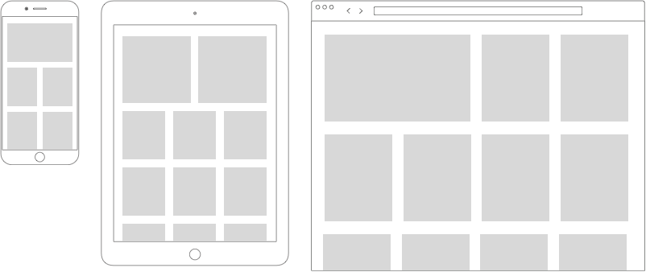

## Homework Week 2

>[Here](/Week3/README.md) you find the readings you have to complete before the third lecture.

### Learning goals for this week:
```
 • CLI
    • To know the terminal/bash/command line for UNIX based systems.
    • Navigate the file system without using a UI explorer.
    • Copy, rename and move files with terminal commands. 
 • Student presentations
 • Last week recap and questions
 • Responsive web development
    • Relative measurements (%, (r)em, vw)
    • Media queries
    • Positioning (absolute, relative, fixed)
    • Floating and clearing
    • Flexbox
 • How to work with the inspector
```

## Step 1: Give feedback:

_Deadline Monday_

- In Trello you are added to one of the cards of your fellow students.
- Give feedback CV assignment of one of your fellow student. Please be critical but most of all give constructive feedback. If there are resources that you used and might be useful, share them.
- Revisit you own CV assignment and improve it with the feedback and suggestions given by one of your classmates.  

## Step 2: Command Line

_Deadline Tuesday_

>We covered a bit of command line usage in the first class and got a program running which is great. If you need a refresher for the command line please have a look here: https://github.com/HackYourFuture/CommandLine

```
Write commands to do following:
1. create a directory. Enter a directory. Create an empty file named blank. 
    2. Then write the content `"Hello"` five times to the file greetings.txt. 
   Then copy the file greetings.txt and paste its contents into 1.txt, 2.txt, 3.txt, 4.txt and 5.txt.
    3. Then write the text "cat" to pets.txt
   Then append the text "dog" to pets.txt
   Then append the text "hamster" to pets.txt
    4. Then write the text "cat" to commands.txt
   Then append the text "ls" to commands.txt
   Then append the text "pwd" to commands.txt
    5. Then find unique strings from these two files pets.txt and commands.txt
   and store the unique strings in lovelyCommands.txt
```

## Step 2: Read/do/watch
 - [Introduction to media queries](https://teamtreehouse.com/library/css3/media-queries/introduction)
 - [More about media queries](https://css-tricks.com/css-media-queries/)
 - [HTML syntax](http://www.w3schools.com/html/html5_syntax.asp)
 - [How CSS selectors work](https://css-tricks.com/how-css-selectors-work/)
 - [Article about multiple ways to select classes and id's](https://css-tricks.com/multiple-class-id-selectors)
 - [Read about nice color combinations](http://www.colorcombos.com/index.html)

### Exercises:
 - CodeAcedemy: [Learn Responsive Design](https://www.codecademy.com/learn/learn-responsive-design)

### Super fun flexbox and grid practice 
 - [flexboxfroggy](https://flexboxfroggy.com/)
 - [cssgridgarden](http://cssgridgarden.com/)

## Step 3: Assignment:

_Deadline Saturday_

> Use the command line to create a directory "week2" inside your hyf-html-css directory. There should already be a week1 inside that contains your homework of last week.

 - Grids exercise
    - Download the HTML and images in the folder Homework 2 ([or click this link to download](https://minhaskamal.github.io/DownGit/#/home?url=https://github.com/HackYourFuture/HTML-CSS/tree/master/Week2/Homework2))
    - You are going to write the CSS for this page
    - You are not allowed to change the HTML
    - The page contains two grids: the first one should work using floats, the second using flex box. Be careful not to mix the two!
    - We want the grid to look as follows (check the wireframe below):
      - On mobile phones: a two column grid, with the exception that the first item spans the full width
      - On tablets: a three column grid, with the exception that the first two items span the full width together (so first we have two columns, then after the first two items we have three columns)
      - On desktops: a four column grid, with the exception that the first item spans two columns.
    - There should be some space between the grid items
    - Make the page look beautiful by adding some more CSS! Some tips:
      - How about some nice colors, fonts, hover styles?
      - According to the grid specification, some products are bigger than others. Maybe these are "highlighted" products, so the rest of the styling could also be different.
    - BEFORE you hand it in, read [the Style guide](http://www.w3schools.com/html/html5_syntax.asp) again and check your files



```
How to hand in your homework:
• Upload your homework in your Github repository. 
• Make sure to create a new folder "week2" first. 
• Your hyf-html-css/week2 should now contain an index.html and a main.css file (and the images folder)
• Place the link to your repository in Trello.
```

## Extra extra (bonus assignment :star: ):

- Add one of the following to your page:
    - An animation using CSS keyframes
    - SVG

## Step 4: Prepare for next class

_Deadline Sunday morning_

Go trough the reading material in the [README.md](/Week3/README.md) to prepare for your next class
